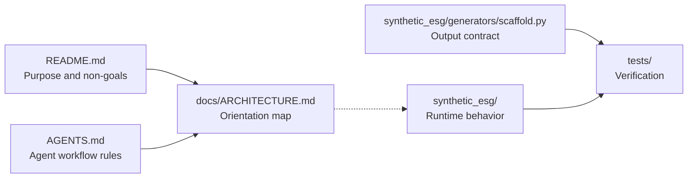
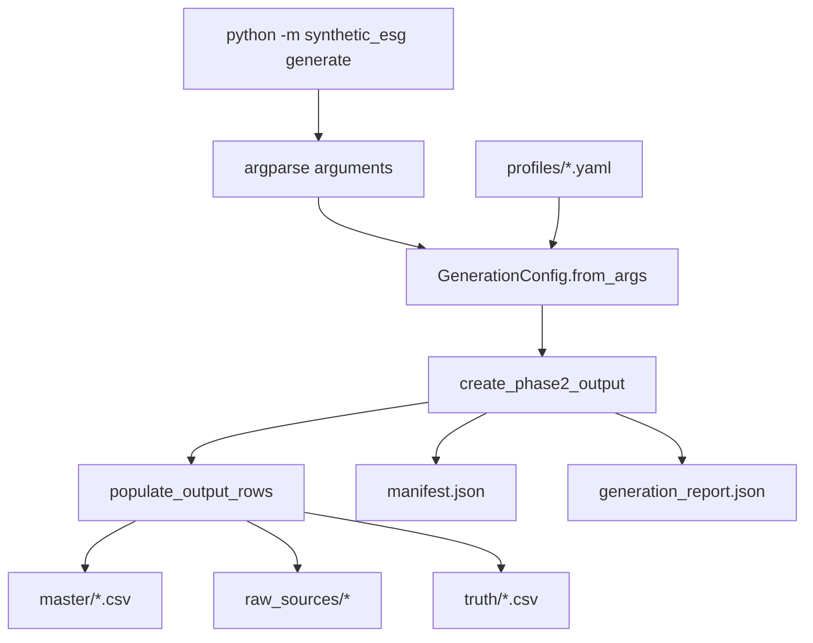
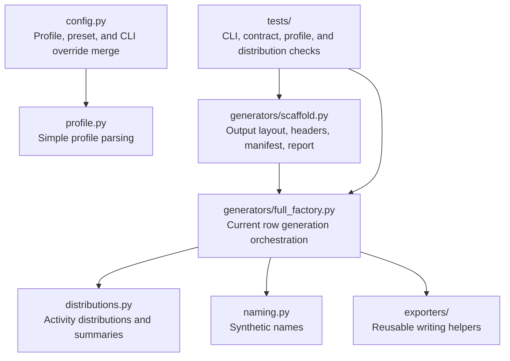

# Architecture

This document helps agents and maintainers orient themselves before changing
the synthetic ESG generator. It is intentionally high level.

## Safety Guardrails

The Mermaid diagrams in this document are an orientation map, not a frozen
design mandate. They should explain the current architecture without preventing
the architecture from changing when the code needs to evolve.

- Keep diagrams focused on stable responsibilities and data flow.
- Do not copy full schemas or output contracts into this document.
- Treat detailed behavior in code and tests as more authoritative than diagrams.
- If a diagram conflicts with code, tests, or README intent, the diagram is
  stale; report the mismatch and update or remove the stale part.
- Mark future ideas as proposed. Do not draw proposed architecture as if it
  already exists.
- Prefer deleting detail from a diagram over making it a second source of truth.

## Source Of Truth Map

Authority order for ambiguous changes:

1. User request for the current task.
2. Code contracts and tests.
3. README purpose and non-goals.
4. This architecture map.
5. Agent convenience notes.

## Generation Flow

## Module Responsibility Map

`full_factory.py` currently owns more orchestration than the package structure
suggests. If future work splits this file, keep this document descriptive:
update the map after the code changes, not before, and avoid inventing a target
architecture unless the user asks for one.

## Boundary

This repository is a synthetic data factory. It should generate raw source
data, master data, truth labels, manifests, and reports. It should not become a
normalization pipeline, analytics service, API server, or real company data
model unless the project purpose is explicitly changed first.
